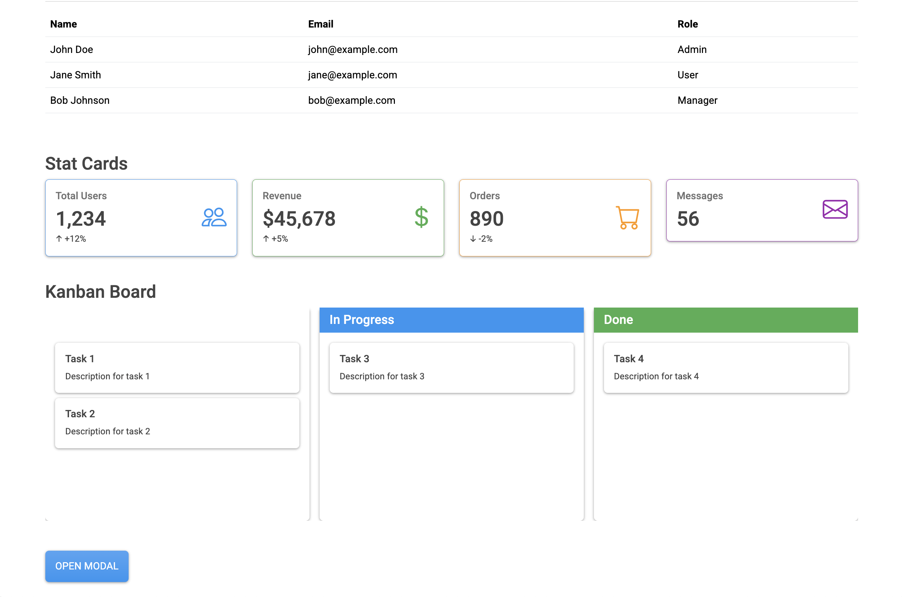

# Django UI Components Library

A production-ready, elegant, and comprehensive UI components library for Django using `django-components`, Bootstrap 5, jQuery, and Crispy Forms.



## Features

- **🎨 Categorized Components**: Basic, Moderate, and Complex components
- **📦 Reusable**: All components follow DRY principles
- **🎯 Type-Safe**: Built with elegant base classes
- **💅 Bootstrap 5**: Modern, responsive styling
- **📝 Form Integration**: Full support for Django forms with Crispy Forms
- **🚀 Production Ready**: Future-proof architecture

## Installation

```bash
pip install -r requirements.txt
python manage.py migrate
python manage.py runserver
```

Visit `http://localhost:8000/` to see the component showcase.

## Component Categories

### Basic Components (`components/basic.py`)
- **Button**: Variants, sizes, disabled states
- **Badge**: Color variants, pill style
- **Alert**: Dismissible alerts, multiple variants
- **Avatar**: Size options, circle/square shapes
- **Spinner**: Loading indicators
- **Divider**: Section separators with optional text
- **Breadcrumb**: Navigation breadcrumbs
- **Tooltip**: Hover tooltips with placement options

### Moderate Components (`components/moderate.py`)
- **Card**: Flexible card layouts with headers/footers
- **Modal**: Dialogs with size options, centered, scrollable
- **Dropdown**: Action menus with dividers and headers
- **Tabs**: Tabbed content navigation
- **Accordion**: Collapsible content sections
- **Pagination**: Page navigation controls
- **Progress**: Progress bars with variants and animations
- **Toast**: Notification toasts
- **Navbar**: Responsive navigation bars

### Complex Components (`components/complex.py`)
- **DataTable**: Sortable, searchable data tables
- **Wizard**: Multi-step form wizards
- **FileUpload**: Drag-and-drop file upload
- **Calendar**: Event calendar with month view
- **Chart**: Data visualization with Chart.js
- **Kanban**: Drag-and-drop kanban boards
- **StatCard**: Dashboard stat cards with trends

### Form Components (`components/forms.py`)
- **CrispyForm**: Django forms with Crispy Forms styling
- **FormField**: Individual form field rendering
- **InlineForm**: Inline form layouts

## Usage

### Basic Usage

```django



  Click me!

```

### With Slots

```django

  Card content goes here.

```

### Form Integration

```python
# forms.py
from django import forms
from crispy_forms.helper import FormHelper
from crispy_forms.layout import Layout, Submit

class ContactForm(forms.Form):
    name = forms.CharField()
    email = forms.EmailField()
    
    def __init__(self, *args, **kwargs):
        super().__init__(*args, **kwargs)
        self.helper = FormHelper()
        self.helper.add_input(Submit('submit', 'Submit'))
```

```django
<!-- template.html -->


```

## Architecture

All components inherit from elegant base classes:

```python
class BasicComponent(Component):
    def get_template_name(self, context, **kwargs):
        return 'basic/' + self.__class__.__name__.lower() + ".html"
```

This ensures:
- **Consistent structure**: All components follow the same pattern
- **Easy extension**: New components are simple to add
- **Automatic template resolution**: No manual template_name required
- **Future-proof**: Ready for expansion

## Component Template Structure

```
components/
  templates/
    basic/
      button.html
      badge.html
      ...
    moderate/
      card.html
      modal.html
      ...
    complex/
      datatable.html
      wizard.html
      ...
    forms/
      crispy_form.html
      field.html
      ...
```

## Technologies

- **Django 5.2+**: Modern Django framework
- **django-components**: Component-based architecture
- **Bootstrap 5**: Responsive UI framework
- **jQuery**: Simplified DOM manipulation
- **Crispy Forms**: Beautiful form rendering
- **Chart.js**: Data visualization (for chart component)

## Examples

Visit the showcase pages:
- `/` or `/showcase/` - Component showcase
- `/forms/` - Form components showcase

## License

MIT License - Feel free to use in your projects.

## Author

Built with elegance and minimalism in mind, inspired by shadcn and daisyUI.
